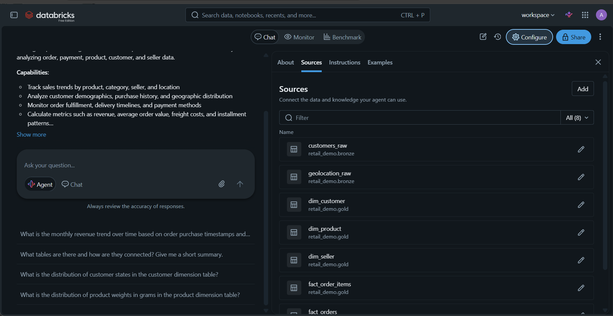
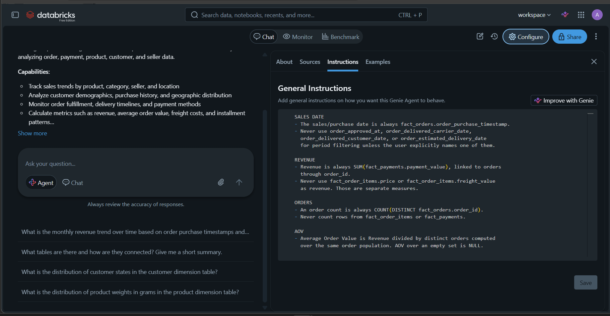
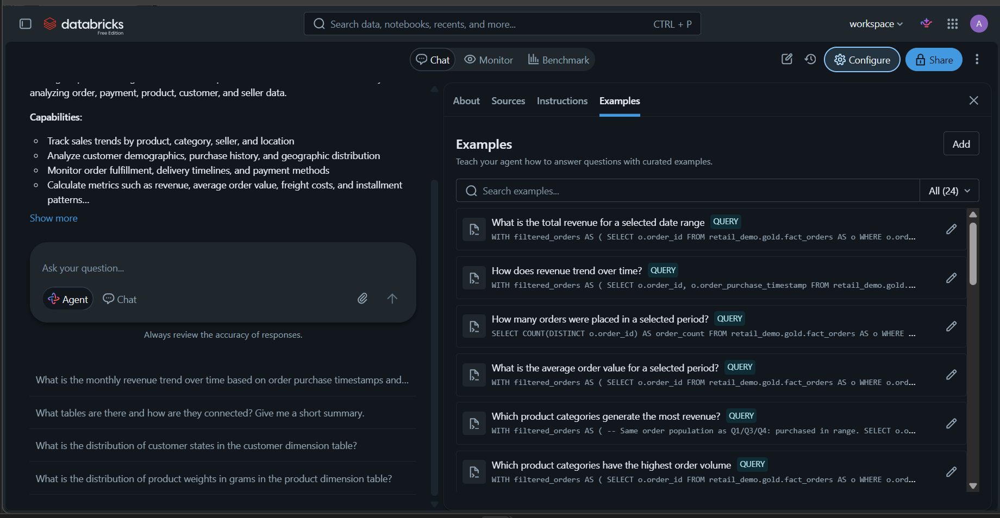
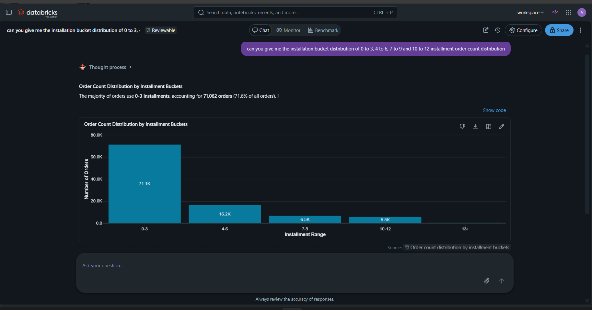
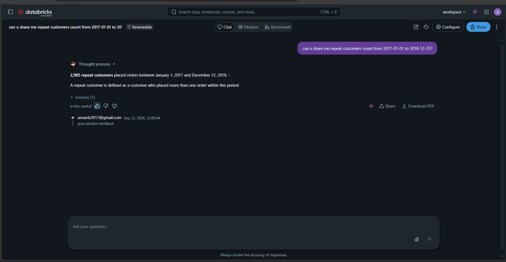

# Retail Data Warehouse + Genie Agent (Olist Brazilian E-commerce)

Intent: build a clean, trustworthy data warehouse on the Olist dataset, plus a
Databricks Genie agent that answers business-level questions in plain English —
simple KPIs directly, and complex breakdowns (category/state/repeat-customer
attribution) without fan-out errors.

## Architecture

```text
Raw Olist CSVs (Unity Catalog Volume)
  -> BRONZE (raw Delta, as-is + ingestion metadata)
  -> SILVER (typed, cleaned, deduped)
  -> GOLD (business dimensional layer: 3 facts + 3 dims)
  -> SQL ANALYTICS (35 curated queries, 7 domains)
  -> GENIE AGENT (NL interface over Gold + curated SQL examples)
```

ELT is notebook-driven (`notebooks/01-04`, run in order):

| Step | Notebook | What it does |
|------|----------|--------------|
| 0 | `01_env_setup` | Creates catalog `retail_demo`, schemas (`bronze`, `silver`, `gold`, `warehouse`, `raw_data`), volume `raw_data.olist_files` |
| 1 | `02_bronze_ingestion` | CSVs -> Delta as-is (all strings, no schema enforcement) + `ingestion_timestamp`, `source_file` |
| 2 | `03_silver_transformation` | Types, trims, dedupes, fixes (`lenght` -> `length`), translates categories |
| 3 | `04_gold_business_layer` | Builds the 6-table business layer + validation |

## Gold design (locked)

Facts (separate — grains differ, never one giant fact):

- `fact_orders` — 1 row/order, PK `order_id`
- `fact_order_items` — 1 row/order item, PK `(order_id, order_item_id)`
- `fact_payments` — 1 row/payment, PK `(order_id, payment_sequential)`

Dimensions:

- `dim_customer` — 1 row/`customer_id`; `customer_unique_id` is the analytical identity
- `dim_product` — 1 row/`product_id`; category translation enriched inline (no separate category dim)
- `dim_seller` — 1 row/`seller_id`; regional attributes inline (no separate geography dim)

Deliberately excluded: reviews (non-unique `review_id`, text complexity),
geolocation (no clean zip -> city/state mapping; region needs are met by
customer/seller dims).

Relationships: `dim_customer -> fact_orders -> {fact_order_items, fact_payments}`,
`fact_order_items -> {dim_product, dim_seller}`. Facts are joined to dims at
query time, never baked into one table (a 3-item x 2-payment order would fan
out to 6 rows and overstate revenue).

## Locked metric definitions

These are enforced in every SQL file and in the Genie instruction block, so the
warehouse, the SQL layer, and the agent can never disagree:

- **Sales date** — always `fact_orders.order_purchase_timestamp`. Never approval/delivery/carrier/estimated dates unless the user names one.
- **Revenue** — always `SUM(fact_payments.payment_value)` via `order_id`. Never `fact_order_items.price` / `freight_value`.
- **Orders** — always `COUNT(DISTINCT fact_orders.order_id)`. Never item/payment row counts.
- **AOV** — Revenue / distinct orders over the same order population; NULL over an empty set.
- **Customers** — `customer_unique_id` is the real identity; `customer_id` is only the order's record key / join to `dim_customer`.
- **Date ranges** — end date inclusive for the full day (`< DATE_ADD(end, 1)`).
- **Join safety** — never join items to payments at row level then sum; category labels prefer `product_category_name_english`, then `product_category_name`, then `'UNKNOWN'` (nulls kept, never dropped).

Hard case, solved once and reused: revenue by product category crosses payment
grain to item grain, so each order's `payment_value` is allocated across its
items proportional to `price` (equal split fallback when price is 0/NULL).
Totals reconcile exactly to period revenue. See `sql/sales_revenue/category_revenue.sql`.

## SQL analytics (`sql/`)

35 curated, parameterized (`:start_date` / `:end_date`, Date) queries across 7
domains, each a reusable pattern the agent references:

| Domain | Queries |
|--------|---------|
| `sales_revenue` | 7 — revenue, trend, order count, AOV, category revenue, category volume, state revenue |
| `customer_analytics` | 5 — unique, repeat rate, frequency distribution, repeat vs one-time revenue, new-customer trend |
| `product_analytics` | 4 — top product, count by category, item sales value, catalog size |
| `seller_analytics` | 6 — count by state, order/item volume, item sales value, assortment, avg price |
| `payment_analytics` | 4 — method usage, installments, method trend, payments per order |
| `delivery_operations` | 5 — on-time rate, avg delivery trend, late volume, status mix, seller performance |
| `geographic_analytics` | 4 — customer distribution, freight, delivery performance, concentration |

Plus `validation.sql` in `sales_revenue` and `customer_analytics` (PASS/FAIL
blocks proving no fan-out, distinct counts, and cross-query reconciliation).

## Genie agent (`genie/GENIE_SETUP.md`)

The agent is configured in the Databricks workspace (config can't be pushed to
Git); `genie/GENIE_SETUP.md` is the rebuild source of truth: identity,
all six Gold tables as direct sources (plus two Bronze supplements for
attributes not yet promoted to Gold — see §2), the single instruction block above, the
curated SQL examples pasted verbatim, the `:start_date`/`:end_date` convention,
and rebuild steps. Simple questions reuse an example skeleton; complex ones
(category/state attribution, repeat-vs-new semantics) follow the documented
assumptions instead of improvising a fan-out join.

## Screenshots

### Genie space — sources



### Genie space — instructions (system prompt)



### Genie space — curated examples



### Answered question — installment distribution (chart)



### Answered question — repeat customers (period-bounded KPI)



## Repo structure

```text
Retail-Datawarehouse/
├── README.md
├── docs/screenshots/        # Genie + workspace screenshots (PNGs, see above)
├── notebooks/               # 01_env_setup, 02_bronze_ingestion, 03_silver_transformation, 04_gold_business_layer
├── sql/                     # 7 analytics domains (35 queries + 2 validation files)
└── genie/GENIE_SETUP.md     # Agent rebuild guide (sources + instructions + examples)
```

## Reproduce

1. Run notebooks `01` -> `04` in Databricks (Free Edition serverless works).
2. Run any `sql/*` file in Databricks SQL with `:start_date` / `:end_date`.
3. Rebuild Genie per `genie/GENIE_SETUP.md` §6 and test one canonical question per slice.
